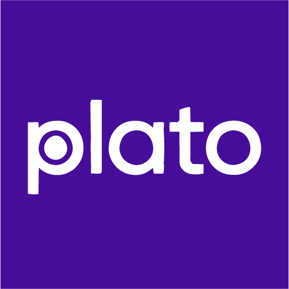

<p align="center">
  
</p>

# plato

An open-source, AI-powered [microlearning](https://philosophers.group/platos-microlearning/) platform. Learners work through focused, exemplar-driven lessons in a continuous conversation with an AI coach that creates activities, evaluates submissions, and tracks progress toward mastery — all in under 20 minutes.

Built by [11:11 Philosopher's Group](https://github.com/1111philo).

Special thanks to [UIC Tech Solutions](https://it.uic.edu/), [UIC TS Open Source Fund](https://osf.it.uic.edu/), [WordPress](https://wordpress.org/), [Louisiana Tech](https://www.latech.edu/), and the [ULL Louisiana Educate Program](https://louisiana.edu/educate).

## How it works

plato applies [microlearning principles](https://philosophers.group/platos-microlearning/) through AI-powered personalization. Each lesson is a focused experience designed to be completable in ~11 exchanges (~20 minutes), built around a single exemplar and 2-4 learning objectives.

A **lesson** defines an exemplar (the mastery-level outcome a learner produces) and a set of learning objectives. When a learner starts a lesson, an AI coach opens a conversation and guides them through activities — coaching, creating tasks, evaluating submissions (text or images), and tracking progress — all in a single continuous chat. The coach enriches a knowledge base as the learner progresses, adapting to their strengths and weaknesses until they achieve the exemplar.

### Microlearning pacing

Lessons are designed for completion within 11 exchanges (~20 minutes), but the system never cuts a learner off. The coach adapts its approach as exchanges accumulate — and always decides when the exemplar has been demonstrated. There is no hard cutoff and no forced closure.

| Exchanges | Coach behavior |
|-----------|---------------|
| 1-7 | Normal coaching — diagnostics, practice, assessment |
| 8-10 | Approaching target — converge toward the exemplar, prefer focused steps |
| 11+ | Past target — drop non-essential objectives, scaffold to the biggest remaining gap |
| 20+ | Well past target — the lesson probably mismatched the learner; coach flags it in `[KB_UPDATE]` but keeps moving them forward |

The admin dashboard tracks an **On-Target Rate** KPI showing what percentage of lessons complete within the 11-exchange target. A low rate means the **lesson design** or **coach prompt** probably needs tuning — not that pacing should be enforced more aggressively. Extended lessons (2× target or beyond) are surfaced as informational diagnostics, never as metrics to drive to zero.

Admins manage everything from `/plato`: lessons, users, a classroom customizer (styles + knowledge base), and integrations.

## Repository structure

```
plato/
  client/       React 18 + Vite SPA (the learner and admin UI)
  server/       Node.js + Hono + AWS Lambda + DynamoDB (API, auth, data, AI proxy)
  scripts/      Build and deploy tooling
```

## Quick start

### Prerequisites

- Node.js 20+
- npm

### Setup and run

```bash
# Clone the repo
git clone https://github.com/1111philo/plato.git
cd plato

# Install dependencies (client and server)
cd client && npm install && cd ../server && npm install && cd ..

# Build the client (server serves the built files)
cd client && npm run build && cd ..

# Configure your API key
cd server && cp .env.example .env
# Edit .env and add your Anthropic API key

# Start the dev server (uses SQLite — no Docker or AWS needed)
node dev-sqlite.js
```

Open [http://localhost:3000](http://localhost:3000).

On first visit you'll name your classroom and create an admin account. Prompts and lessons are seeded automatically. The knowledge base is created by admins through the conversational KB Editor in the Customizer.

### AI provider

plato needs access to Claude models. Set one of these:

| Option | Env var | Best for |
|--------|---------|----------|
| **Anthropic API** (recommended) | `ANTHROPIC_API_KEY=sk-ant-...` | Local dev, small deployments |
| **Amazon Bedrock** | AWS credentials + `AI_PROVIDER=bedrock` | Production on AWS |

The Anthropic API key is the easiest way to get started. Get one at [console.anthropic.com](https://console.anthropic.com/settings/keys).

If `ANTHROPIC_API_KEY` is set, plato uses it automatically. For Bedrock, set `AI_PROVIDER=bedrock` and configure AWS credentials.

Then log in and navigate to `/plato` to see the admin dashboard, or `/lessons` to start learning.

### Development workflow

For client changes with hot reload:

```bash
cd client && npm run dev    # Vite dev server on :5173
```

For server changes (restart required):

```bash
cd server && node dev-sqlite.js    # API server on :3000
```

When developing the client with Vite's dev server, API calls go to `localhost:3000` — configure your browser or use a proxy.

> **AI features** require the server to proxy to Amazon Bedrock. Without it, the app is fully navigable but lesson conversations won't work.

## Architecture

### Overview

- **Login required** — all data is server-side, no browser storage beyond auth tokens
- **8 AI agents** via Amazon Bedrock: coach, lesson-owner, lesson-creator, lesson-extractor, knowledge-base-editor, knowledge-base-extractor, learner-profile-owner, learner-profile-update
- **Admin dashboard** at `/plato` — manage lessons, users, classroom customizer (styles + knowledge base), and integrations
- **Single-tenant** — one instance per deployment, global settings, multiple admins

### Client

React SPA built with Vite. Key areas:

| Directory | Purpose |
|-----------|---------|
| `src/pages/` | Route-level components (lessons, settings, login, admin) |
| `src/components/` | Shared UI (AppShell, chat, modals) |
| `src/contexts/` | React contexts (auth, app state, modals) |
| `src/lib/` | Engines (lesson loop, lesson creation, profile queue, sync) |
| `js/` | Service modules (storage, orchestrator, auth, API, lesson parsing, validators) |

Admin pages under `src/pages/admin/` are lazy-loaded and role-gated.

### Server

Hono framework on AWS Lambda with DynamoDB (or SQLite for local dev). Two Lambda functions handle requests:

- **API Gateway** — buffered responses for CRUD operations
- **Function URL** — streaming SSE for AI chat responses

**DynamoDB tables:** users, invites, refresh-tokens, sync-data, audit-log

All content (system prompts, lessons, knowledge base, theme/branding, classroom identity) is stored in the sync-data table under a `_system` user — no additional tables needed.

**Auth:** JWT access tokens (15 min) + refresh tokens (30 day, rotated). Invite-based registration. First-time setup creates the initial admin via a UI flow.

### AI agents

| Agent | Role |
|-------|------|
| **Coach** | Learner's companion in one continuous conversation — coaches, creates activities, evaluates submissions, tracks progress |
| **Lesson Owner** | Initializes a lesson knowledge base from the lesson prompt + learner profile |
| **Lesson Creator** | Guides admins through designing lessons via conversation |
| **Lesson Extractor** | Extracts lesson markdown from a creation conversation |
| **Knowledge Base Editor** | Helps admins create and edit the program knowledge base via conversation |
| **Knowledge Base Extractor** | Merges existing KB with conversation changes to produce updated markdown |
| **Learner Profile Owner** | Deep profile update on lesson completion |
| **Learner Profile Update** | Incremental profile update from feedback/observations |

System prompts are bundled in `client/prompts/` and upserted to the database on every server startup. Admins cannot edit prompts directly — prompt changes are deployed through code updates.

## Deploying to AWS

### Prerequisites

- AWS SAM CLI
- An AWS account with permissions for Lambda, DynamoDB, API Gateway, IAM, S3, and SES
- A verified SES sender email/domain
- An Anthropic API key or Amazon Bedrock access

### 1. SSM parameters

Create these in AWS Systems Manager Parameter Store before deploying. Replace `{stage}` with your stage name (e.g., `prod`, `playground`):

| Parameter | Type | Description |
|-----------|------|-------------|
| `/plato/{stage}/jwt-secret` | SecureString | JWT signing secret |
| `/plato/{stage}/ses-from-email` | String | Verified SES sender email |
| `/plato/{stage}/app-url` | String | Public URL (for invite/reset links) |
| `/plato/{stage}/admin-email` | String | Bootstrap admin email (optional — setup UI handles this) |
| `/plato/{stage}/admin-password` | SecureString | Bootstrap admin password (optional) |

### 2. Configure SAM

Copy the example config and customize it for your AWS account:

```bash
cd server
cp samconfig.toml.example samconfig.toml
# Edit samconfig.toml — set your region, stack name, and AWS profile
```

`samconfig.toml` is gitignored so your local config stays out of version control.

### 3. Deploy manually

```bash
# Build client
cd client && npm ci && npm run build && cd ..

# Build server
cd server && sam build

# Bundle client SPA into Lambda artifacts
cp -r ../client/dist .aws-sam/build/PlatoStreamFunction/client-dist
cp -r ../client/dist .aws-sam/build/PlatoApiFunction/client-dist

# Bundle content source files (prompts, lessons) for seeding
mkdir -p .aws-sam/build/PlatoApiFunction/client-content .aws-sam/build/PlatoStreamFunction/client-content
cp -r ../client/prompts ../client/data .aws-sam/build/PlatoApiFunction/client-content/
cp -r ../client/prompts ../client/data .aws-sam/build/PlatoStreamFunction/client-content/

# Generate version.json from the latest Beta-RC-* tag
VERSION=$(git describe --tags --abbrev=0 --match='Beta-RC-*' 2>/dev/null || echo 'Beta-RC-0')
echo "{\"version\":\"${VERSION}\"}" > .aws-sam/build/PlatoApiFunction/version.json
cp .aws-sam/build/PlatoApiFunction/version.json .aws-sam/build/PlatoStreamFunction/version.json

# Deploy (default stage is prod)
sam deploy
# Or deploy a specific stage
sam deploy --parameter-overrides Stage=playground --stack-name plato-playground
```

The `Stage` parameter controls DynamoDB table name prefixes and SSM parameter paths. See `server/template.yaml` for the full infrastructure definition.

### 4. Set up CI/CD (recommended)

For production deployments, we recommend automating deploys from a **private fork** via GitHub Actions. This keeps your AWS credentials and deploy config out of the public repo. The flow here uses `repository_dispatch`: pushing to the public repo fires a dispatch event to the private fork, which runs the actual deploy. No manual pushing to the deploy remote, and the deploy workflows never need to exist in the public repo.

**Create a private fork:**

```bash
gh repo fork 1111philo/plato --fork-name my-plato --org my-org --clone=false
gh repo edit my-org/my-plato --visibility private --accept-visibility-change-consequences
```

**Set up OIDC authentication** (no static AWS keys needed):

1. Ensure your AWS account has a GitHub OIDC provider (one-time setup):
   ```bash
   aws iam create-open-id-connect-provider \
     --url https://token.actions.githubusercontent.com \
     --client-id-list sts.amazonaws.com \
     --thumbprint-list 6938fd4d98bab03faadb97b34396831e3780aea1
   ```

2. Create an IAM role that GitHub Actions can assume. The trust policy should allow your private fork repo:
   ```json
   {
     "Version": "2012-10-17",
     "Statement": [{
       "Effect": "Allow",
       "Principal": {
         "Federated": "arn:aws:iam::YOUR_ACCOUNT_ID:oidc-provider/token.actions.githubusercontent.com"
       },
       "Action": "sts:AssumeRoleWithWebIdentity",
       "Condition": {
         "StringEquals": { "token.actions.githubusercontent.com:aud": "sts.amazonaws.com" },
         "StringLike": { "token.actions.githubusercontent.com:sub": "repo:my-org/my-plato:*" }
       }
     }]
   }
   ```

3. Attach a permissions policy to the role with access to CloudFormation, Lambda, S3, API Gateway, DynamoDB, IAM (for role creation), and SSM (parameter reads).

**Create a dispatch token:** In GitHub, generate a fine-grained personal access token with `contents:write` permission scoped to your private fork. Add it to the **public repo** as a secret named `DEPLOY_DISPATCH_TOKEN`. The public repo's trigger workflow uses this token to fire dispatch events at the private fork.

**The trigger workflow** lives in the public repo at `.github/workflows/trigger-deploy.yml` (already included in this project). On push to `main` or `playground`, it fires a `deploy-prod` or `deploy-playground` `repository_dispatch` event at the private fork with the commit SHA as payload.

**Add a deploy workflow** to your private fork at `.github/workflows/deploy.yml`:

```yaml
name: Deploy to AWS

on:
  repository_dispatch:
    types: [deploy-prod]
  workflow_dispatch:
    inputs:
      ref:
        description: 'Ref on the public repo to deploy (branch / tag / SHA)'
        required: false
        default: 'main'

env:
  SOURCE_REPO: my-org/my-plato-source  # your public repo
  SOURCE_REF: ${{ github.event.client_payload.sha || inputs.ref || 'main' }}

jobs:
  test:
    runs-on: ubuntu-latest
    steps:
      - uses: actions/checkout@v4
        with:
          repository: ${{ env.SOURCE_REPO }}
          ref: ${{ env.SOURCE_REF }}
      - uses: actions/setup-node@v4
        with:
          node-version: 20
      - run: cd server && npm ci && npm test

  deploy:
    needs: test
    runs-on: ubuntu-latest
    permissions:
      id-token: write
      contents: read
    steps:
      - uses: actions/checkout@v4
        with:
          repository: ${{ env.SOURCE_REPO }}
          ref: ${{ env.SOURCE_REF }}
          fetch-depth: 0  # need history + tags so we can read the latest Beta-RC-* tag
      - uses: actions/setup-node@v4
        with:
          node-version: 20
      - uses: aws-actions/setup-sam@v2
        with:
          use-installer: true
      - uses: aws-actions/configure-aws-credentials@v4
        with:
          role-to-assume: arn:aws:iam::YOUR_ACCOUNT_ID:role/YOUR_DEPLOY_ROLE
          aws-region: YOUR_REGION
      - run: cd client && npm ci && npm run build
      - run: cd server && sam build
      - run: |
          cp -r client/dist server/.aws-sam/build/PlatoApiFunction/client-dist
          cp -r client/dist server/.aws-sam/build/PlatoStreamFunction/client-dist
      - run: |
          mkdir -p server/.aws-sam/build/PlatoApiFunction/client-content server/.aws-sam/build/PlatoStreamFunction/client-content
          cp -r client/prompts client/data server/.aws-sam/build/PlatoApiFunction/client-content/
          cp -r client/prompts client/data server/.aws-sam/build/PlatoStreamFunction/client-content/
      - name: Generate version.json from latest tag
        run: |
          VERSION=$(git describe --tags --abbrev=0 --match='Beta-RC-*' 2>/dev/null || echo 'Beta-RC-0')
          echo "{\"version\":\"${VERSION}\"}" > server/.aws-sam/build/PlatoApiFunction/version.json
          cp server/.aws-sam/build/PlatoApiFunction/version.json server/.aws-sam/build/PlatoStreamFunction/version.json
      - run: >
          cd server && sam deploy
          --config-env ci
          --stack-name plato
          --region YOUR_REGION
          --s3-bucket YOUR_SAM_S3_BUCKET
          --s3-prefix plato
          --capabilities CAPABILITY_IAM
          --no-confirm-changeset
          --no-fail-on-empty-changeset
          --parameter-overrides Stage=prod
```

Replace `YOUR_ACCOUNT_ID`, `YOUR_DEPLOY_ROLE`, `YOUR_REGION`, `YOUR_SAM_S3_BUCKET`, and `SOURCE_REPO` with your values. The S3 bucket is the one SAM creates on first manual deploy (named `aws-sam-cli-managed-default-samclisourcebucket-*`).

**Pre-deploy backups:** Add a step before `sam deploy` to back up your DynamoDB tables. For example, loop over your table names and call `aws dynamodb create-backup` for each, then prune old backups (keeping the last 5 per table).

**Multiple environments:** For a staging environment (e.g., `playground`), add a second workflow to the private fork that listens on `repository_dispatch` type `deploy-playground` and deploys with `--stack-name plato-playground --parameter-overrides Stage=playground`. Each stage gets its own DynamoDB tables and SSM parameters. The trigger workflow in the public repo already fires `deploy-playground` on push to the `playground` branch.

**Workflow:** Push or merge to the public repo's `main` or `playground` — the trigger workflow fires the dispatch, the private fork's deploy workflow picks it up, checks out the public repo at that SHA, runs tests, and deploys. Tests run first — deploy only happens if they pass. For re-deploying a specific SHA manually, use `workflow_dispatch` on the private fork's deploy workflow with an optional `ref` input.

### Custom domain (optional)

To serve the app from a custom domain:

1. Create a CloudFront distribution with the Lambda Function URL as a **Custom Origin** (HTTPS-only)
2. Set the Origin Request Policy to **AllViewerExceptHostHeader** (required for Lambda Function URLs)
3. Set the Cache Policy to **CachingDisabled** (the Lambda handles caching headers)
4. Add your domain as a CloudFront alternate domain name and attach an ACM certificate (must be in us-east-1)
5. Point your DNS (CNAME or alias) to the CloudFront distribution domain

### Backups

Production DynamoDB tables are protected by two backup layers:

- **Point-in-Time Recovery (PITR)** — enabled on all 5 prod tables, allowing restore to any second in the last 35 days. Handles accidental deletes, data corruption, or bugs discovered after the fact.
- **Pre-deploy snapshots** — the CI/CD deploy workflow automatically creates on-demand backups of all prod tables before each deploy. Old backups are pruned to keep the last 5 per table. These provide named restore points tied to specific deploys.

To restore from a pre-deploy snapshot, use the AWS Console (DynamoDB > Backups) or the CLI:

```bash
aws dynamodb restore-table-from-backup \
  --target-table-name plato-users-restored \
  --backup-arn arn:aws:dynamodb:us-east-2:ACCOUNT:table/plato-users/backup/BACKUP_ID
```

To restore from PITR:

```bash
aws dynamodb restore-table-to-point-in-time \
  --source-table-name plato-users \
  --target-table-name plato-users-restored \
  --restore-date-time 2026-04-01T12:00:00Z
```

In both cases, DynamoDB restores to a new table — rename or swap as needed.

## Versioning

plato uses a `Beta-RC-X` version scheme tracked via git tags. On each push to `main` (typically from a merged PR), `.github/workflows/version-bump.yml` creates the next `Beta-RC-N` tag and a matching GitHub release. No version file is tracked in git — `version.json` is generated at deploy time from the latest tag and included in the Lambda bundle. The current version is displayed in the admin sidebar with a link to the GitHub repo.

The `main` branch is protected — all changes require a pull request.


## Accessibility

plato is designed to be fully accessible with screen readers (VoiceOver, NVDA, JAWS) and keyboard-only navigation.

- All interactive elements have accessible names and are keyboard-operable
- Route changes are announced via a global `ScreenReaderAnnounce` component
- Skip-to-content link on every page

### Chat interface

The AI chat is built for screen reader compatibility following the [MITRE Chatbot Accessibility Playbook](https://mitre.github.io/chatbot-accessibility-playbook/) and [Orange accessibility guidelines](https://a11y-guidelines.orange.com/en/articles/chatbot/):

- **Silent by default** — the chat log uses `role="log"` with `aria-live="off"` and `aria-label="Chat log"` so VoiceOver never reads messages unprompted
- **Controlled announcements** — a separate `role="status"` live region announces "New message from coach" only when a complete response arrives, then auto-clears after ~3s so the text doesn't linger as navigable DOM content
- **Streaming content hidden** — in-progress AI responses are `aria-hidden` to prevent screen readers from reading partial text
- **Sender identification** — each message includes a screen-reader-only prefix ("Coach says:" / "You said:") that reads inline as part of the message content, so messages aren't burdened with duplicate aria labels
- **Keyboard navigation** — `Alt+ArrowUp` / `Alt+ArrowDown` to jump between messages in the chat log
- **Send shortcut** — `Cmd+Return` (macOS) or `Ctrl+Enter` (Windows/Linux) sends a message; plain `Enter` inserts a newline
- **Dialog focus** — modal dialogs (e.g., lesson Objectives) move focus to their title on open so the dialog's purpose is announced first
- **Focus management** — when focus is in the chat log, new messages receive focus automatically; when focus is elsewhere, only the status announcement fires
- **Tab notification** — document title flashes "(New message)" when the browser tab is in the background

## Reporting issues

Issues and feature requests go in [GitHub Issues](https://github.com/1111philo/plato/issues). An automated intake agent reads every new issue and either tags it `ready-for-pilot` (enough detail to act on) or `needs-info` (replies with a few clarifying questions). To skip the back-and-forth, include upfront:

- The URL or page where it happened
- What you did (exact steps)
- What you expected vs. what actually happened
- Any error message, screenshot, or browser console output
- Your browser + OS, and whether you were signed in as a learner or admin

The intake agent only asks for things you can provide. It never asks you to inspect code — that's our job.

Questions, discussions, or general feedback (not tied to a specific bug or enhancement) are welcome too — the intake agent will leave those for a human to respond to.

## Contributing

See [CONTRIBUTING.md](CONTRIBUTING.md) for setup instructions, guidelines, and how to submit changes.

## License

Copyright (C) 2026 [11:11 Philosopher's Group](https://github.com/1111philo)

This program is free software: you can redistribute it and/or modify it under the terms of the [GNU Affero General Public License v3.0](LICENSE) as published by the Free Software Foundation.

This means you're free to use, modify, and distribute this software, but any modified version that's accessible over a network must also be made available under the same license. See the [LICENSE](LICENSE) file for details.
